# paulystack

**Stop outsourcing your understanding.**

<p align="center">
  
</p>

paulystack is a Claude Code plugin marketplace with one plugin, also called `paulystack`. Its skills make the agent research before it acts, plan before it writes code, and prove a change works before it says "done". You still read the diff, make the decisions, and run `git commit` yourself.

## Why "paulystack"

*Poly* means many. A polymath knows many fields. A polygon is a flat shape with many sides, simple by itself. Cut enough of them into one stone and you get a diamond: a round brilliant has 57 facets, and every one is a flat polygon.

That is how the plugin is built. Each skill does one small job: map the code, write the plan, prove the change, cross-examine the proof, explain the diff. None of them is clever alone. Together, they turn an agent's output into work you understand and can stand behind. Paul + poly = pauly.

In the picture, each band of facets is one skill of the core loop below. `create-verify-profile` is the pavilion the stone rests on, and `debrief-changes` is the table on top, the window you look through. `call-saul` gets the star facets, as any star witness should. The other five (`pr-recon`, `technical-writing`, `explain`, `eli5`, `skill-authoring`) are tools you reach for around it.

## The philosophy

An agent that writes code faster than you can read it is a liability if you stop reading. paulystack keeps the automation and keeps you in the loop:

- **Research before acting.** Map the code that's already there, check the current docs for the versions you pin, and look for prior art before proposing anything.
- **A plan before code.** The plan names the files, the existing helpers to reuse, and how the change will be verified.
- **A proof before "done".** Every claim the change makes gets a command, its captured output, and a verdict: `seen`, `inferred`, `not checked`, or `failed`. Proof that doesn't actually show the claim is never marked `seen`.
- **A cold cross-exam.** A fresh-context reviewer reads the proof as if it were a case file and returns only the objections that leave reasonable doubt.
- **You hold the pen.** The skills never commit or push. In your repo they write only the change you asked for, or a doc or skill you approved; their own reports and pages go under your home directory unless you give a path. On staging, pauly-mode writes only through the verify profile's safe test actions, each with its cleanup, and only after you OK it that turn. Before you commit, a debrief walks you through what changed and why.

The agent does the legwork. You keep the understanding.

## How it works

```
  recon ──────────────┐   understand the code and the docs
  plan-kickoff ───────┤   research pass, then an explicit plan
                      ▼
  pauly-mode ─────────┐   implement; prove each claim on the right stage
   (verify profile    │   using the repo's verify profile
    from create-      │
    verify-profile)   ▼
  call-saul ──────────┐   pauly-mode calls it to cross-examine the proof
                      ▼
  debrief-changes ────    you read the diff grouped by concept, then commit
```

1. **Once per repo**, `/paulystack:create-verify-profile` researches how the repo runs, how it's tested, and how to check what is deployed. It tries each command before saving the profile to `~/.claude/verify-profiles/<repo>/profile.md`.
2. **Before a change**, `recon` maps the code and returns an analysis. `/paulystack:plan-kickoff` runs the same research pass in plan mode and ends in a plan whose verification section comes from the profile.
3. **While you work**, `/paulystack:pauly-mode` stays on for the session. Each turn that changes code gets a playbook (bug, feature, perf, refactor, or investigation) and a stage (local, staging, prod). Every proof step is logged and written to a report under `~/.claude/verifications/<repo>/`. Before it reports a verdict, pauly-mode hands the report to `call-saul`. Each objection is either answered by a new proof step or listed as a check only you can do, which lowers the verdict. A change with no runtime effect (docs, comments, test-only) takes a short fast path with no cross-exam.

   Without a profile, pauly-mode stops before editing, names the path it checked, and offers to continue with fallback proof labeled `no profile`: the repo's tests, a run or verify recipe in `.claude/skills/`, or a launch from the README. Questions that need fresh evidence (logs, metrics) still work without one.
4. **Before you commit**, `debrief-changes` explains the uncommitted diff.

`pr-recon` runs the same research pass on a teammate's pull request and drafts review comments for you to post. `technical-writing`, `explain`, `eli5`, and `skill-authoring` cover writing docs, learning a topic, and building your own skills.

pauly-mode is careful outside your machine: prod is read-only, staging writes go only through the profile's safe test actions after you OK them, and it never reads `.env` files other than `*.example`.

## Install

You need Claude Code and `git`. The bundled MCP servers need `npx`, and `pr-recon` needs `gh` signed in.

1. Add the marketplace:

   ```bash
   claude plugin marketplace add SupaxInc/paulystack
   ```

2. Install the plugin:

   ```bash
   claude plugin install paulystack@paulystack
   ```

   You should see `✔ Successfully installed plugin: paulystack@paulystack (scope: user)`.

3. Start a new session, or run `/reload-plugins` in an open one. `claude plugin details paulystack` should list `Skills (11)`.

To pick up a new release, run `claude plugin marketplace update paulystack`, then `claude plugin update paulystack@paulystack`. The plugin's `version` pins installs, so you only get changes once the version is bumped.

## First run

In a repo you want to work on:

1. Create the verify profile:

   ```
   /paulystack:create-verify-profile
   ```

   It asks once for what no file shows, such as staging URLs or which staging actions are safe, then shows the draft for your OK before writing it.

2. Turn on pauly-mode with a task:

   ```
   /paulystack:pauly-mode the export button returns a 500 when the list is empty
   ```

   You should see a status line like `pauly-mode on · <repo> · profile: fresh · …`, then `Playbook: bug, because …` and `Stage: local, because …`. The reply ends with one proof block per "done" criterion and the path to the report.

## Skills

Model-triggered skills start when a request matches their description; you can also type the slash command. Manual skills start only from the slash command.

| Skill | What it does | How to start it | Writes |
|---|---|---|---|
| `create-verify-profile` | Researches how the repo runs, is tested, and is deployed, tries each command, and saves the profile pauly-mode uses | Manual: `/paulystack:create-verify-profile [notes]` | `~/.claude/verify-profiles/<repo>/` |
| `recon` | Maps the code, checks current docs, searches the web, and fans out subagents. Returns an analysis, no plan or code | Model-triggered, or `/paulystack:recon <objective>` | nothing |
| `plan-kickoff` | The recon research pass in plan mode, ending in an explicit implementation plan | Manual: `/paulystack:plan-kickoff <objective>` | Claude Code's plan file (default `~/.claude/plans/`) |
| `pauly-mode` | Session-long mode: a playbook and a captured proof for every code change or investigation, cross-examined before the verdict (except the fast path) | Manual: `/paulystack:pauly-mode [task]`; `off` to stop | `~/.claude/verifications/<repo>/` |
| `call-saul` | Cross-examines a pauly-mode report in a fresh context and returns objections, each with the command that would answer it. Changes nothing | Model-triggered ("call saul", "poke holes in the proof"), or called by pauly-mode | nothing; pauly-mode saves its answer as `cross-exam-r<n>.md` |
| `debrief-changes` | Explains your uncommitted changes grouped by concept; complex diffs also get an HTML page tracing a request through the code | Model-triggered ("debrief my changes"), or `/paulystack:debrief-changes [brief\|explain\|deep]` | `~/.cache/debrief-changes/` for the HTML page |
| `pr-recon` | Reviews a teammate's PR read-only and prints ranked findings with draft comments. Never posts to GitHub | Manual: `/paulystack:pr-recon <PR# \| URL \| branch>` | `~/.cache/pr-recon/` for the HTML page |
| `technical-writing` | Writes and reviews RFCs, PR descriptions, commit messages, tickets, and READMEs from facts it reads. Outputs text to paste; it doesn't post or create tickets | Model-triggered, or `/paulystack:technical-writing [doc type or draft path]` | where you ask, or chat |
| `explain` | A short, first-principles explanation of any topic | Manual: `/paulystack:explain <topic>` | nothing |
| `eli5` | A dead-simple picture explainer as a local HTML page | Manual: `/paulystack:eli5 <topic>` | `~/.claude/eli5/` |
| `skill-authoring` | Writes new skills and reviews existing `SKILL.md` files, including evals that beat a no-skill baseline | Model-triggered, or `/paulystack:skill-authoring [goal or SKILL.md path]` | the skill files, after you approve |

The plugin also starts two MCP servers through `npx`: Context7, which the research skills use for current library docs, and Playwright, for driving a browser when a proof needs a UI.

## Where files live

Proof, profiles, and review pages stay on your machine, outside your repo. Plans go to Claude Code's plan folder. Docs and skill files go where you ask.

| Path | Holds |
|---|---|
| `~/.claude/verify-profiles/<repo>/profile.md` | How to run, drive, and check the repo. One per repo, shared by all its worktrees |
| `~/.claude/verifications/<repo>/<branch>/report.md` | pauly-mode's runs for a branch (`/` in the branch name becomes `-`), with `logs/` and call-saul's `cross-exam-r<n>.md` beside it. Reports are append-only; nothing deletes them |
| `~/.claude/verifications/<repo>/investigations/` | pauly-mode's evidence-backed answers to questions |
| `~/.cache/debrief-changes/`, `~/.cache/pr-recon/` | HTML pages for complex diffs and PR findings |
| `~/.claude/eli5/` | eli5 pages |

Verify profiles can name internal systems, so they are never written into a repo.

## License

[MIT](LICENSE)
